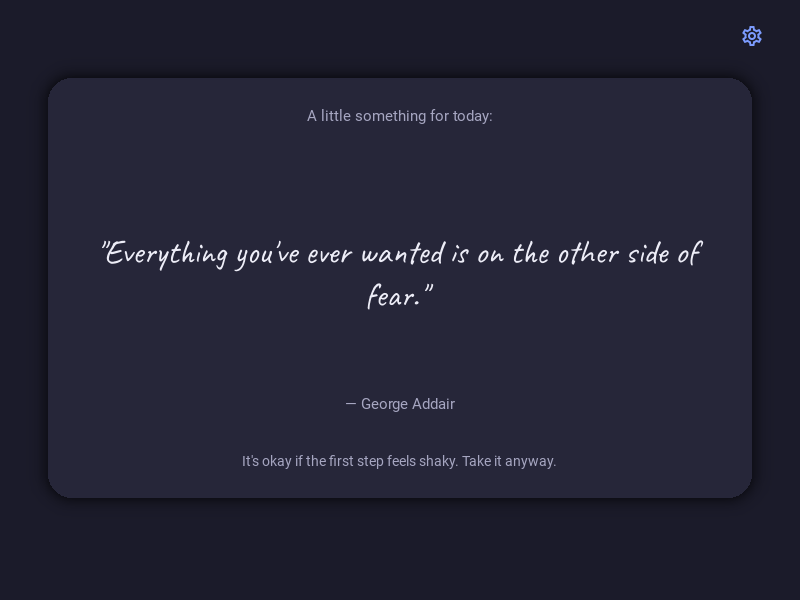
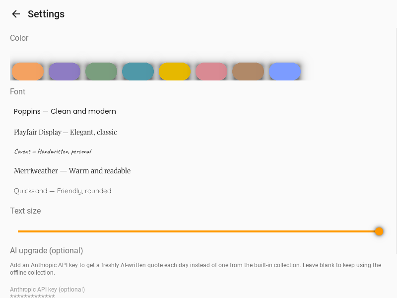

# Quote of the Day

A small, warm, offline-first Android app. Open it, and there's a quote
waiting for you -- picked for today, dressed up with a short human intro
line and a one-sentence reflection, in colors and a font you chose.

<p>
  
  
</p>

## What it actually does

- **A new quote every day**, picked from an 86-quote offline collection
  (`data/quotes.json`), cycling through the whole collection before any
  quote repeats -- and never repeating the same quote twice in a row even
  across a cycle boundary.
- **Doesn't feel mechanical.** Each quote is wrapped with a short, varied
  intro line and a one-sentence reflection that matches its theme
  (perseverance, courage, calm, gratitude, and so on) -- picked from a pool
  that changes day to day, so it doesn't read like a database dump.
- **Fully offline by default.** No internet, no account, no setup beyond
  installing it. If you add your own Anthropic API key in Settings, it
  swaps to a freshly AI-written quote each day instead -- and quietly falls
  back to the offline collection if the key's missing, invalid, or there's
  no signal.
- **Two-tap customization.** A grid of 8 color palettes and 5 fonts
  (previewed live, in their own typeface) -- not a full color wheel or a
  font browser. Pick one of each and you're done.
- **A quiet streak counter** -- "N days in a row" once you've opened it two
  days running. No push notifications, no guilt-tripping, just there if you
  want it.

## Quick start (test it on your computer first)

```powershell
python -m venv .venv
.venv\Scripts\activate
pip install -r requirements.txt
python main.py
```

This runs the real app in a desktop window, using the same code that ships
to Android -- good for trying out colors/fonts or checking your own added
quotes before building the APK.

## Building the real, installable APK

Buildozer (the tool that packages this into an `.apk`) **only runs on
Linux**, not Windows. Rather than asking you to set up WSL or a Linux VM,
this project includes a GitHub Actions workflow that builds it in the cloud:

1. Create a new GitHub repo and push this project to it.
2. GitHub Actions will pick up `.github/workflows/build-apk.yml`
   automatically -- or trigger it manually from the repo's **Actions** tab
   ("Build Android APK" → **Run workflow**).
3. Wait for the build to finish (10-20 minutes the first time; faster on
   later runs thanks to caching).
4. Open the finished run, scroll to **Artifacts**, and download
   `quote-of-the-day-apk` -- it contains `quoteofday-1.0.0-arm64-v8a_armeabi-v7a-debug.apk`
   (exact filename may vary slightly by Buildozer version).
5. Copy that `.apk` to your phone (email it to yourself, use a USB cable,
   Google Drive, whatever's easiest) and tap it to install. You'll need to
   allow "install from unknown sources" the first time Android asks --
   normal for any app installed outside the Play Store.

**Heads up:** Android toolchain builds are notorious for one-off hiccups on
a machine/CI runner they haven't run on before (a missing system package,
a version mismatch). This workflow is built from well-established,
standard Buildozer CI steps, but if the first run fails, open the failed
step's log -- it almost always names the exact missing package or
dependency clash, which you can then add to the `apt-get install` line or
`buildozer.spec`'s `requirements =` line. This is normal for Android
builds generally, not a sign anything here is broken.

*(If you do have access to a Linux machine or WSL, you can skip GitHub
Actions entirely: `pip install buildozer`, then `buildozer android debug`
from the project folder -- the first build downloads the Android SDK/NDK
and takes a while, later ones are much faster.)*

## Making it yours

**Add your own quotes** -- edit `data/quotes.json`, a plain list of
`{"text": ..., "author": ..., "tag": ...}` objects. `tag` should be one of:
`perseverance`, `resilience`, `self_belief`, `growth`, `courage`,
`gratitude`, `kindness`, `new_beginnings`, `calm`, `purpose` (or a new tag
of your own -- unmapped tags just get a generic reflection instead of a
themed one, nothing breaks).

**Add a color palette or font** -- both are plain lists in `theme.py`
(`PALETTES` and `FONTS`). To add a font, drop a `.ttf` file under
`assets/fonts/<name>/` and add an entry pointing to it.

**Enable AI-generated quotes** -- open the app, tap the gear icon, paste an
Anthropic API key (get one at [console.anthropic.com](https://console.anthropic.com)),
tap Save. Uses `claude-haiku-4-5-20251001` -- fast and inexpensive for one
short generation a day.

## How it's built

- **`quote_engine.py`** -- which quote is "today's quote" (deterministic,
  shuffled, no-repeat-until-full-cycle) and the warm intro/reflection
  wrapper. No Kivy import -- pure functions over plain dicts.
- **`theme.py`** -- the 8 palettes and 5 fonts.
- **`storage.py`** -- settings + daily state, saved as one small local JSON
  file. No Kivy import either.
- **`ai_quotes.py`** -- the optional Claude-generated upgrade path. Never
  raises; returns `None` on any failure so the caller falls back to the
  offline engine.
- **`main.py`** -- the actual Kivy/KivyMD app: two screens (Home,
  Settings), wiring the above together.

Keeping the logic modules free of any Kivy import was deliberate -- it's
what let this get properly unit-tested (35 tests, `pytest tests/`) without
needing a phone or a display.

## Notes on how this was tested

The UI in `main.py` wasn't just written and hoped-for -- it was actually
run and screenshotted (headless, via Xvfb) during development, which caught
and fixed two real bugs before you ever saw this: an invalid Kivy property
that crashed on startup, and a Settings screen that overflowed off-screen
on smaller viewports. The two screenshots above are from those real runs,
not mockups.

What wasn't tested: a real device (screen sizes, Android permission
prompts, and touch behavior can only really be confirmed on-device), and a
real Anthropic API call (the AI path is tested with a mocked response --
worth trying for real once you've added a key).

## Notification behavior

By design, this app shows a fresh quote **the moment you open it** each
day (including waking from the background, not just a cold start) rather
than pushing a background notification while fully closed. That was a
deliberate simplicity trade-off: true background notifications on Android
need a persistent service, boot-on-startup permissions, and exact-alarm
scheduling -- a lot more moving parts, more battery-permission prompts for
you to grant, and more that can quietly break on a given phone/Android
version. If you later want that, `docs` of `python-for-android`'s service
support is the place to start; happy to help build it if the simple
version feels like it's missing something.

## License note on the bundled fonts

The 5 fonts under `assets/fonts/` are from Google Fonts, licensed OFL 1.1
(free to use/modify/redistribute). See `assets/fonts/ATTRIBUTION.md`.
